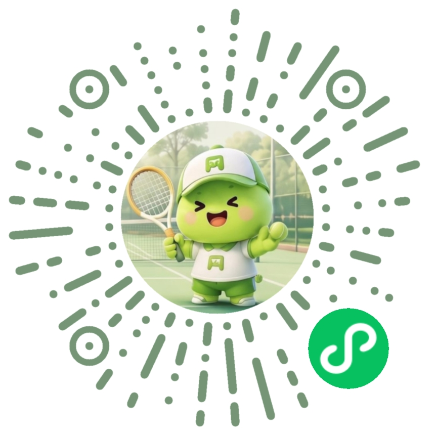
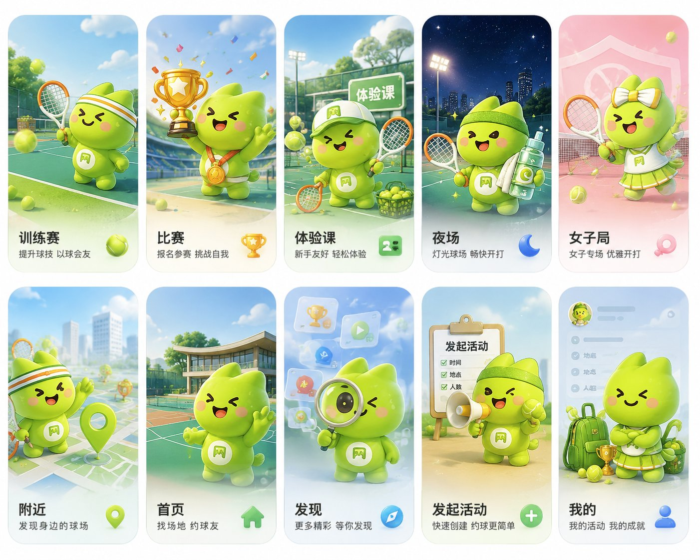

# 网球bauhouse — 微信小程序

> 一款面向网球爱好者的**约球 + 找场地**小程序。从 0 到 1 独立完成产品定义、UI 设计、前端开发、云函数后端、内容安全合规与审核上线。

<p align="center">
  
  <br />
  <em>微信扫码即可体验</em>
</p>

---

## 产品简介

网球bauhouse（原「网搭星球」）是一款**原生微信小程序**，帮助网球爱好者：

- **约球** — 发起/参加训练赛、比赛、体验课、夜场、女子局等活动
- **找场地** — 覆盖全国 4000+ 网球场地，按城市/类型/距离筛选
- **社区** — 查看活动动态、场地转让、场地照片分享
- **成长** — 个人资料、网球水平、成就系统

### 核心功能一览

<p align="center">
  
</p>

---

## 技术架构

```
┌─────────────────────────────────────────────────┐
│                  微信小程序客户端                   │
│  ┌──────┐ ┌──────┐ ┌──────┐ ┌──────┐ ┌──────┐  │
│  │ 首页  │ │ 发现  │ │ 场地  │ │ 活动  │ │ 我的  │  │
│  └──┬───┘ └──┬───┘ └──┬───┘ └──┬───┘ └──┬───┘  │
│     └────────┴────────┴────────┴────────┘       │
│              app.js (全局状态 / 数据层)            │
├─────────────────────────────────────────────────┤
│              微信云开发 (CloudBase)               │
│  ┌─────────┐ ┌─────────┐ ┌─────────┐            │
│  │ activities│ │  users   │ │courts    │            │
│  │ messages │ │feedbacks │ │transfers │            │
│  │notifications│courtPhotos│  ...     │            │
│  └────┬────┘ └────┬────┘ └────┬────┘            │
│       └──────────┬─┴──────────┘                   │
│              云函数 (Serverless)                   │
│  ┌──────┐┌──────┐┌──────┐┌──────┐┌──────────┐   │
│  │activities││user  ││feedback││msg  ││courtTrans│   │
│  │        ││      ││      ││fer  ││  fer    │   │
│  └──────┘└──────┘└──────┘└──────┘└──────────┘   │
│       内容安全 (msgSecCheck + 本地敏感词兜底)       │
└─────────────────────────────────────────────────┘
```

### 技术栈

| 层级 | 技术 | 说明 |
|------|------|------|
| **前端** | 原生微信小程序 (WXML/WXSS/JS) | 自定义 tabBar、16 页自定义导航栏 |
| **后端** | 微信云开发 CloudBase | 10+ 云函数，Serverless 架构 |
| **数据库** | 云数据库 (MongoDB 风格) | 7 个集合：activities/users/messages/notifications/feedbacks/courtTransfers/courtPhotos |
| **存储** | 云存储 (COS) | 用户头像、场地照片 UGC |
| **内容安全** | msgSecCheck v2 + 本地敏感词兜底 | fail-closed 双保险策略 |
| **地图** | 腾讯地图 API | LBS 定位 + 4000+ 场地数据 |
| **数据管道** | Python 爬虫 + JSONL 数据流 | 场地数据批量抓取与导入 |

---

## 产品思考：我怎么定义和打磨这个产品

做这个小程序，我最先想清楚的不是"要哪些功能"，而是**网球爱好者真正卡在哪**。我自己打球，也观察过身边球友：想找人约一场，得在群里喊、碰运气；想找个合适的场地，信息散在大众点评、高德、各种公众号里，没有专门的地方。所以产品的价值锚点很清晰——**把"约球"和"找场地"这两件最高频的痛点，做成同一件事**。

### 1. 从用户场景倒推 MVP，而不是从功能清单出发

我没有一上来就铺功能，而是先定义了四类典型用户和他们的使用场景：

- **新手**：想体验但怕被虐 → 需要"新手体验局"这种低门槛入口
- **周末党**：固定双打搭子难凑 → 需要快速发起 / 加入活动
- **夜场党 / 女子局**：特定时段、特定人群的局 → 需要标签和筛选
- **场地党**：常驻某几个场 → 需要收藏和历史

基于这些场景，我把 MVP 优先级定为 **找场地 > 约球 > 个人中心 > 社区 > 场地转让**。"场地转让"放在最后，是因为它本质是交易类功能，审核风险高、用户频次低，不适合在冷启动阶段占用精力。这个取舍后来也被证明是对的——它确实成了审核时我选择先关掉、过审再开的功能。

### 2. 设计不是"好看"，是一套能复用的体系

做到第 16 个页面时我意识到，如果每个页面各画各的，后期一定会走形。所以我建立了一套 **DS 设计规范**，把视觉决策固化下来：

- **色彩**：主绿 `#68BE45` / 主黄 `#FFD64D` / 粉 `#FF99A7`，以及全站唯一的功能红 `#E54D42`——明确禁掉蓝色、橙色和一堆"差不多"的黄色，避免开发时凭感觉选色
- **层级**：字号只给 6 级（40/36/32/28/24/22 rpx），圆角只给 5 档 + 胶囊按钮；宁可少，不能乱
- **一致性**：12 套通顶渐变 + 固定导航栏 + 滚动毛玻璃，让 16 个页面有一种"同一个产品"的体感
- **IP 形象**：「网小帅」「网小美」网球吉祥物，用在空态、引导、成就这类需要"人情味"的地方

我的判断是：**规范的价值不在于限制创意，而在于让一个人在没有设计评审的情况下，也能产出风格统一的东西**——这对 solo 开发尤其重要。

### 3. 用数据反推工程决策，而不是拍脑袋

几个关键迭代，都是从"用户实际怎么用"倒推出来的：

- **冷启动白屏**：最初上线发现，首屏只加载了 60 条场地，切一次城市才出 600+。根因是云端冷启动超时回退了本地兜底数据，且把脏数据写进了城市缓存。我没有简单"加大超时"，而是让加载做**自愈**：云端没就绪就挂起等全量到达，且**绝不把回退数据写进缓存**。
- **内容安全漏检**：实测发现微信 `msgSecCheck` 对"鸡巴"这类低俗词居然放行。我判断不能单点信任厂商 API，于是补了一层**本地敏感词兜底 + fail-closed**——任何非明确通过的结果一律拒发。这不是"多加一道检查"，而是把"漏放"的风险成本压到最低。
- **前端谎报成功**：用户反馈"发布被拦却显示成功"。定位到是 `app.saveActivity` 吞掉了云函数返回的 `ok:false`。修的时候我想清楚一件事：**错误信息的责任应该在调用链上每一层都明确传递，而不是在某一层被"消化"掉**。

### 4. 把审核合规当成产品信任的一部分

微信审核两次打回（隐私政策空白、登录无取消、内容安全风险、缺注销入口），我没有当成"应付检查"，而是借机把产品的信任机制补全：

| 审核打回的原因 | 我的理解 | 怎么改 |
|--------------|---------|--------|
| 隐私政策空白 | 用户不知道数据去哪了 | 重写完整的《隐私保护指引》，把 7 类信息收集的目的写明白 |
| 登录无取消按钮 | 强制登录 = 把用户关在门外 | 登录弹层加关闭 + "暂不登录先逛逛"，先逛后登 |
| 内容安全风险 | 平台对 UGC 零容忍 | 4 个文本发布入口全部接内容安全，fail-closed |
| 缺注销入口 | 有注册无注销 = 不合规 | 新建 `deleteAccount`，按 openid 级联清理 6 个集合 |

我的底层逻辑是：**合规不是上线前补漏洞，而是产品信任感的一部分**。一个用户愿意填手机号、发活动，前提是他相信你能管好这些数据。

---

## 工程实现：一个人扛下全栈

### 1. 全栈不是"都会一点"，是每一层都得对

客户端约 15,000 行（16 个页面 + 自定义 tabBar + 登录组件），后端是 10+ 个云函数。关键不在于"写了两端"，而在于**两端的契约要自己对齐**：

- 全局状态（`app.js`）统一管理 courts / activities / users / transfers，云端优先、本地降级（`isCloudReady()` 门控），断网也不崩
- 云函数按职责拆分，每个都有清晰的输入输出。重点处理的几个：

| 云函数 | 职责 | 我重点处理的点 |
|--------|------|--------------|
| `activities` | 活动 CRUD + 内容安全 | msgSecCheck + 本地兜底，fail-closed |
| `user` | 用户资料 | openid 由云环境注入，天然只能改自己 |
| `sendPrivateMessage` | 私信 + 通知 | 写消息同时生成通知，尽量原子 |
| `courtTransfer` / `courtPhoto` | 转让 / 照片 | 从本地 stub 改成真实上云 + 内容安全 |
| `deleteAccount` | 注销 | 级联清理 6 个集合，单步失败不阻断 |
| `getCourts` | 场地分页 | 游标分页绕过云函数 1000 条上限 |

### 2. 内容安全：不信任任何单点的防御

上面产品部分提过，微信 API 会漏检。工程上我的做法是**两层 + fail-closed**：

```
用户输入文本
    │
    ▼
┌─────────────────┐     命中     ┌──────────────┐
│  本地敏感词兜底   │ ─────────► │  直接拦截      │
│  (localBlock)    │             │  ok: false    │
└────────┬────────┘             └──────────────┘
         │ 未命中
         ▼
┌─────────────────┐     异常     ┌──────────────┐
│  msgSecCheck v2  │ ─────────► │  拦截         │
│  (微信官方API)    │             │  ok: false    │
└────────┬────────┘             └──────────────┘
         │ 通过
         ▼
    ┌──────────┐
    │  放行      │
    │  ok: true │
    └──────────┘
```

- 本地敏感词表兜底，命中即拦，不依赖网络和外部服务
- 微信 `msgSecCheck` 做第二层，但它的异常和"放行"我都当成"不确定"，一律拒发
- 5 个文本发布路径（活动、评论、私信、反馈、转让）全覆盖，没有漏网之鱼

我刻意没用微信的 `mediaCheckAsync`（视频异步检测）——它需要配控制台回调 URL，基建依赖重，对一个 solo 项目是负担。改用同步的 `imgSecCheck` 校验封面帧，够用且稳。这是工程上"够用优先于完美"的判断。

### 3. 数据工程：让 4000 条场地"秒开"

场地数据是我用 Python 爬虫从腾讯地图 POI 拉下来的（4000+ 条），走 JSONL 导入云库。但数据有了，体验还得解决：

- **首屏秒开**：bundled 60 条兜底 + 云端 4000+，用户进来看得到东西，云端再补全
- **分页绕过限制**：云函数单次查询上限 1000 条，我按 600/页游标翻页，合并返回
- **缓存失效**：跨环境迁移后旧缓存会污染，用 `COURTS_CACHE_KEY` 版本号（v9→v11）强制刷新
- **图标自动化**：AI 生图 → 自动裁切 → 256×256 PNG + 类型定义，把"做图"变成"生产流程"

### 4. 跨账号迁移：把不可逆操作拆成可验证的小步

因为一些原因，我做过一次小程序账号迁移（旧 appid → 新 appid）。这本质上是**数据搬迁 + 配置重建**，出错就是用户数据丢。我的做法是：

- 数据库 7 个集合先导出再导入，逐集合核对
- 订阅消息模板 ID 跨 appid 不能复用，逐个在新后台重建再替换
- 云函数、地图 Key、云环境 ID、隐私协议全量替换后，用真机跑一遍核心路径验收

每一步都可独立验证，出问题能定位到具体哪一步，而不是"全量迁移后整体挂了"。

---

## 项目结构（展示用，不含源码）

```
tennis-booking-miniprogram/
├── pages/                 # 16 个页面
│   ├── home/              # 首页（活动列表 + 快捷入口）
│   ├── discover/          # 发现（分类浏览）
│   ├── find-court/        # 找场地（LBS + 筛选）
│   ├── detail/            # 活动详情
│   ├── create/            # 发起活动
│   ├── profile/           # 个人中心
│   ├── edit-profile/      # 编辑资料（含视频）
│   ├── court-detail/      # 场地详情 + 照片上传
│   ├── transfer/          # 场地转让（发布/列表）
│   ├── match/             # 比赛专区
│   ├── achievements/      # 成就系统
│   ├── notifications/     # 消息通知
│   ├── feedback/          # 反馈/举报
│   ├── settings/          # 设置
│   └── privacy/           # 隐私政策
├── components/            # 复用组件
│   ├── login-sheet/       # 登录弹层
│   └── activity-card/     # 活动卡片
├── cloudfunctions/        # 10+ 云函数
├── utils/                 # 工具模块
│   ├── activitiesData.js  # 活动数据层（云端/本地双模式）
│   ├── courtsData.js      # 场地数据层（缓存 + 分页）
│   ├── courtTransfer.js   # 转让数据层
│   ├── courtPhoto.js      # 照片数据层
│   ├── auth.js            # 登录/注销/资料
│   ├── features.js        # 功能开关（提审 gating）
│   ├── location.js        # LBS 定位
│   └── privacy.js         # 隐私授权
├── assets/
│   ├── icons/ui/          # 45 个 UI 图标
│   ├── tabbar/            # 自定义 tabBar 图标
│   └── images/            # 页面配图
├── data/
│   ├── courts.js          # 60 条 bundled 兜底场地
│   └── remote/            # 云端数据（JSONL）
└── app.js                 # 全局状态 + 数据层入口
```

---

## 关键技术决策记录

| 决策点 | 方案 | 原因 |
|--------|------|------|
| 内容安全策略 | fail-closed 双保险 | 微信 API 对低俗词漏检，单点依赖不可靠 |
| 视频内容安全 | imgSecCheck 封面帧 | mediaCheckAsync 需控制台回调 URL，基建依赖重；封面帧同步检测够用且稳 |
| 缓存失效 | 版本号 bump (v9→v10→v11) | 跨环境迁移后旧缓存污染，版本号最简单可靠 |
| 场地数据 | bundled 60 + 云端 4000+ | 首屏秒开（bundled）+ 完整数据（云端），冷启动不白屏 |
| 功能开关 | utils/features.js | 提审时一键关闭未合规功能（SOCIAL/TRANSFER 等），过审后再开 |
| 转让/照片 | 从本地 stub → 真实上云 | 审核要求功能真实可用；云函数 + 内容安全 + 云存储 |

---

## 开发工具链

- **IDE**：微信开发者工具 + CLI（预览/上传/部署自动化）
- **版本控制**：Git（分支 `restore/clean-from-bugs`）
- **图标工作流**：AI 生图 → Icon Sheet Factory 自动裁切 → 多格式输出
- **数据抓取**：Python + 腾讯地图 POI API → JSONL → 云数据库导入
- **预览验证**：CLI 生成真机预览二维码 → 手机微信扫码验收

---

## 关于作者

独立产品经理 + 全栈开发者（Vibe Coding）。本项目从产品定义、UI 设计、前端开发到云函数后端、内容安全合规、审核上线，全部由一人完成。

- **产品思维**：用户场景驱动、MVP 优先、数据驱动迭代
- **技术栈**：微信小程序原生开发 + CloudBase Serverless + Python 数据管道
- **设计能力**：完整 DS 设计体系 + IP 形象设计 + AI 辅助生图
- **合规经验**：两次审核打回后的完整整改闭环

---

## 许可证

本项目仅作**作品集展示**，源代码暂不开源。

<p align="center">
  
  <br />
  <em>微信扫一码，体验网球bauhouse</em>
</p>
