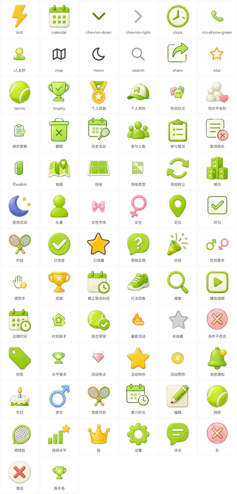

# 网球bauhouse — 微信小程序

> 一款面向网球爱好者的**约球 + 找场地**小程序。从 0 到 1 独立完成产品定义、UI 设计、前端开发、云函数后端、内容安全合规与审核上线。

[](screenshots/qrcode.jpg)

---

## 产品简介

网球bauhouse（原「网搭星球」）是一款**原生微信小程序**，帮助网球爱好者：

- **约球** — 发起/参加训练赛、比赛、体验课、夜场、女子局等活动
- **找场地** — 覆盖全国 4000+ 网球场地，按城市/类型/距离筛选
- **社区** — 查看活动动态、场地转让、场地照片分享
- **成长** — 个人资料、网球水平、成就系统

### 核心功能一览

<p align="center">
  
</p>

---

## 技术架构

```
┌─────────────────────────────────────────────────┐
│                  微信小程序客户端                   │
│  ┌──────┐ ┌──────┐ ┌──────┐ ┌──────┐ ┌──────┐  │
│  │ 首页  │ │ 发现  │ │ 场地  │ │ 活动  │ │ 我的  │  │
│  └──┬───┘ └──┬───┘ └──┬───┘ └──┬───┘ └──┬───┘  │
│     └────────┴────────┴────────┴────────┘       │
│              app.js (全局状态 / 数据层)            │
├─────────────────────────────────────────────────┤
│              微信云开发 (CloudBase)               │
│  ┌─────────┐ ┌─────────┐ ┌─────────┐            │
│  │ activities│ │  users   │ │courts    │            │
│  │ messages │ │feedbacks │ │transfers │            │
│  │notifications│courtPhotos│  ...     │            │
│  └────┬────┘ └────┬────┘ └────┬────┘            │
│       └──────────┬─┴──────────┘                   │
│              云函数 (Serverless)                   │
│  ┌──────┐┌──────┐┌──────┐┌──────┐┌──────────┐   │
│  │activities││user  ││feedback││msg  ││courtTrans│   │
│  │        ││      ││      ││fer  ││  fer    │   │
│  └──────┘└──────┘└──────┘└──────┘└──────────┘   │
│       内容安全 (msgSecCheck + 本地敏感词兜底)       │
└─────────────────────────────────────────────────┘
```

### 技术栈

| 层级 | 技术 | 说明 |
|------|------|------|
| **前端** | 原生微信小程序 (WXML/WXSS/JS) | 自定义 tabBar、16 页自定义导航栏 |
| **后端** | 微信云开发 CloudBase | 10+ 云函数，Serverless 架构 |
| **数据库** | 云数据库 (MongoDB 风格) | 7 个集合：activities/users/messages/notifications/feedbacks/courtTransfers/courtPhotos |
| **存储** | 云存储 (COS) | 用户头像、场地照片 UGC |
| **内容安全** | msgSecCheck v2 + 本地敏感词兜底 | fail-closed 双保险策略 |
| **地图** | 腾讯地图 API | LBS 定位 + 4000+ 场地数据 |
| **数据管道** | Python 爬虫 + JSONL 数据流 | 场地数据批量抓取与导入 |

---

## 产品经理能力体现

### 1. 从 0 到 1 的产品定义

- 独立完成**竞品分析**（网球类小程序痛点：约球难、场地信息散、社区弱）
- 定义 MVP 功能优先级：**找场地 > 约球 > 个人中心 > 社区 > 场地转让**
- 设计用户角色与使用场景：新手体验局 / 周末双打 / 夜场打球 / 女子专场

### 2. UI/UX 设计体系（DS Design System）

建立了一套完整的**设计规范**，覆盖全站 16 个自定义导航页面：

- **色彩系统**：主绿 `#68BE45` / 主黄 `#FFD64D` / 粉 `#FF99A7` / 警示红 `#E54D42`
- **字号阶梯**：40/36/32/28/24/22 rpx，6 级层次
- **圆角阶梯**：32/24/16/12/8 rpx + 胶囊按钮 999rpx 全圆角
- **12 套通顶渐变**：每页专属渐变 + 固定导航栏 + 滚动毛玻璃效果
- **45 个 UI 图标库**：`assets/icons/ui/` 统一图标资源
- **IP 形象**：「网小帅」「网小美」网球吉祥物，贯穿全站空态与引导页

### 3. 数据驱动的迭代决策

- **缓存策略演进**：v9 → v10 → v11，三次版本迭代解决「首次加载 60 条 vs 切城市 600+」的冷启动时序 bug
- **内容安全双保险**：发现微信 `msgSecCheck` 对低俗词（如「鸡巴」）存在漏检 → 补本地敏感词兜底表，fail-closed 策略确保零漏放
- **前端响应处理修复**：定位并修复「内容拦截成功但前端谎报发布成功」的 bug（`app.saveActivity` 吞掉 `ok:false` 返回值）

### 4. 合规与审核攻坚

微信小程序审核**两次打回**后的完整整改：

| 审核打回原因 | 整改方案 |
|-------------|---------|
| 隐私政策空白 | 重写完整《隐私保护指引》（7 类信息收集声明） |
| 登录无取消按钮 | 登录弹层加 × 关闭 + 「暂不登录先逛逛」 |
| 活动内容安全风险 | 4 个云函数 `scanText` 改 fail-closed + 本地敏感词兜底 |
| 注销账号缺失 | 新建 `deleteAccount` 云函数（openid 级联清理 6 个集合） |

---

## Web Coding 能力体现

### 1. 全栈开发（前端 + 云函数后端）

**客户端**（~15,000 行 JS/WXML/WXSS）：
- 16 个页面 + 自定义 tabBar 组件 + 登录弹层组件
- 全局状态管理（`app.js` globalData）：courts / activities / users / transfers
- 云端优先 + 本地降级策略（`isCloudReady()` 门控）
- 城市缓存 + 冷启动自愈机制

**云函数**（10+ Serverless 函数）：

| 云函数 | 职责 | 关键技术点 |
|--------|------|-----------|
| `activities` | 活动 CRUD + 内容安全 | msgSecCheck v2 + localBlock 兜底 |
| `user` | 用户资料读写 | openid 自动注入（安全） |
| `sendPrivateMessage` | 私信 + 通知生成 | 事务性写入 |
| `feedback` | 反馈/举报 | 内容安全扫描 |
| `courtTransfer` | 场地转让发布/列表/删除 | msgSecCheck fail-closed |
| `courtPhoto` | 场地照片上传 + imgSecCheck | 云存储 + 图片内容安全 |
| `mediaCheck` | 同步图片内容安全校验 | imgSecCheck 封面帧检测 |
| `deleteAccount` | 账号注销 | 级联清理 6 个集合 |
| `getCourts` | 场地分页查询 | 游标分页（>1000 条） |
| `registerMember` | 活动成员登记 | 幂等写入 |

### 2. 内容安全工程化

```
用户输入文本
    │
    ▼
┌─────────────────┐     命中     ┌──────────────┐
│  本地敏感词兜底   │ ─────────► │  直接拦截      │
│  (localBlock)    │             │  ok: false    │
└────────┬────────┘             └──────────────┘
         │ 未命中
         ▼
┌─────────────────┐     异常     ┌──────────────┐
│  msgSecCheck v2  │ ─────────► │  拦截         │
│  (微信官方API)    │             │  ok: false    │
└────────┬────────┘             └──────────────┘
         │ 通过
         ▼
    ┌──────────┐
    │  放行      │
    │  ok: true │
    └──────────┘
```

- **fail-closed 原则**：任何非明确通过的结果一律拒绝
- **双保险**：微信 API 漏检时本地兜底词表补拦（实测「鸡巴」等低俗词被微信放过）
- **5 个文本发布路径全覆盖**：activities / feedback / sendPrivateMessage / user / courtTransfer

### 3. 数据工程

- **场地数据管道**：Python 爬虫 → 腾讯地图 POI API → JSONL → 云数据库导入（4000+ 条）
- **分页查询优化**：`getCourts` 按 600 条/页游标分页，解决云函数 1000 条限制
- **缓存失效机制**：`COURTS_CACHE_KEY` 版本号 bump（当前 v11），跨环境迁移强制刷新
- **Icon Sheet 工作流**：AI 生图 → 自动裁切 → 256×256 PNG + icon-map.json + TypeScript 类型定义

### 4. 跨环境迁移

从旧账号 (`wxa7ff3f83cb86fbbd`) 完整迁移到新账号 (`wx08a8b45824bd4e5b`)：
- 云数据库 7 个集合导出/导入
- 订阅消息模板 ID 重建（跨 appid 不可复用）
- 云函数重新部署（10+ 函数）
- 地图 Key / 云环境 ID / 隐私协议全量替换

---

## 页面截图

### 找场地
<p align="center">
  
</p>

### 发现页
<p align="center">
  
</p>

### 个人中心
<p align="center">
  
</p>

### 编辑资料
<p align="center">
  
</p>

### UI 资产库
<p align="center">
  
</p>

---

## 项目结构（展示用，不含源码）

```
tennis-booking-miniprogram/
├── pages/                 # 16 个页面
│   ├── home/              # 首页（活动列表 + 快捷入口）
│   ├── discover/          # 发现（分类浏览）
│   ├── find-court/        # 找场地（LBS + 筛选）
│   ├── detail/            # 活动详情
│   ├── create/            # 发起活动
│   ├── profile/           # 个人中心
│   ├── edit-profile/      # 编辑资料（含视频）
│   ├── court-detail/      # 场地详情 + 照片上传
│   ├── transfer/          # 场地转让（发布/列表）
│   ├── match/             # 比赛专区
│   ├── achievements/      # 成就系统
│   ├── notifications/     # 消息通知
│   ├── feedback/          # 反馈/举报
│   ├── settings/          # 设置
│   └── privacy/           # 隐私政策
├── components/            # 复用组件
│   ├── login-sheet/       # 登录弹层
│   └── activity-card/     # 活动卡片
├── cloudfunctions/        # 10+ 云函数
├── utils/                 # 工具模块
│   ├── activitiesData.js  # 活动数据层（云端/本地双模式）
│   ├── courtsData.js      # 场地数据层（缓存 + 分页）
│   ├── courtTransfer.js   # 转让数据层
│   ├── courtPhoto.js      # 照片数据层
│   ├── auth.js            # 登录/注销/资料
│   ├── features.js        # 功能开关（提审 gating）
│   ├── location.js        # LBS 定位
│   └── privacy.js         # 隐私授权
├── assets/
│   ├── icons/ui/          # 45 个 UI 图标
│   ├── tabbar/            # 自定义 tabBar 图标
│   └── images/            # 页面配图
├── data/
│   ├── courts.js          # 60 条 bundled 兜底场地
│   └── remote/            # 云端数据（JSONL）
└── app.js                 # 全局状态 + 数据层入口
```

---

## 关键技术决策记录

| 决策点 | 方案 | 原因 |
|--------|------|------|
| 内容安全策略 | fail-closed 双保险 | 微信 API 对低俗词漏检，单点依赖不可靠 |
| 视频内容安全 | imgSecCheck 封面帧 | mediaCheckAsync 需控制台回调 URL，基建依赖重；封面帧同步检测够用且稳 |
| 缓存失效 | 版本号 bump (v9→v10→v11) | 跨环境迁移后旧缓存污染，版本号最简单可靠 |
| 场地数据 | bundled 60 + 云端 4000+ | 首屏秒开（bundled）+ 完整数据（云端），冷启动不白屏 |
| 功能开关 | utils/features.js | 提审时一键关闭未合规功能（SOCIAL/TRANSFER 等），过审后再开 |
| 转让/照片 | 从本地 stub → 真实上云 | 审核要求功能真实可用；云函数 + 内容安全 + 云存储 |

---

## 开发工具链

- **IDE**：微信开发者工具 + CLI（预览/上传/部署自动化）
- **版本控制**：Git（分支 `restore/clean-from-bugs`）
- **图标工作流**：AI 生图 → Icon Sheet Factory 自动裁切 → 多格式输出
- **数据抓取**：Python + 腾讯地图 POI API → JSONL → 云数据库导入
- **预览验证**：CLI 生成真机预览二维码 → 手机微信扫码验收

---

## 关于作者

独立产品经理 + 全栈开发者（Vibe Coding）。本项目从产品定义、UI 设计、前端开发到云函数后端、内容安全合规、审核上线，全部由一人完成。

- **产品思维**：用户场景驱动、MVP 优先、数据驱动迭代
- **技术栈**：微信小程序原生开发 + CloudBase Serverless + Python 数据管道
- **设计能力**：完整 DS 设计体系 + IP 形象设计 + AI 辅助生图
- **合规经验**：两次审核打回后的完整整改闭环

---

## 许可证

本项目仅作**作品集展示**，源代码暂不开源。

<p align="center">
  
  <br />
  <em>微信扫一码，体验网球bauhouse</em>
</p>
